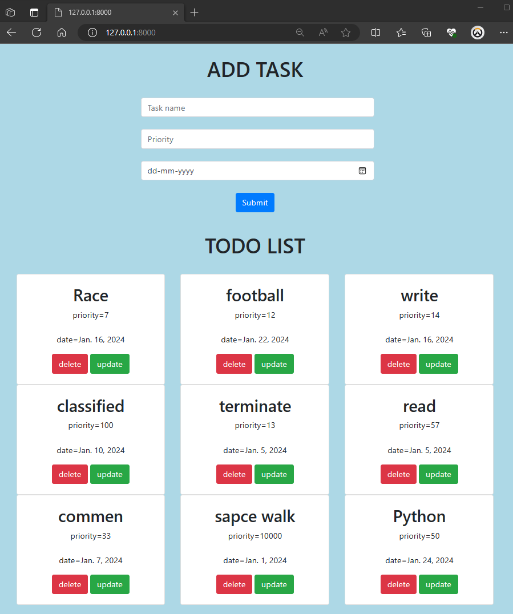

# Django Simple Todo list project with Djnago framework 
This is a simple  Todo list project website built with Django,Python,HTML,CSS,Bootstrap  

 

Todo List Application
This is a simple Todo List application built using Django, a high-level Python web framework.
It allows users to create, view, update, and delete tasks. The project utilizes Class-Based Views (CBVs)
provided by Django's generic views for efficient code organization and reusability.

Features
Task Management: Users can add, view, edit, and delete tasks.
Priority and Due Date: Each task can have a priority level and a due date associated with it.
User Interface: The application provides a clean and intuitive user interface for easy task management.

Usage
Adding a Task: Click on the "Add Task" button and fill in the task details, including name, priority, and due date.
Viewing Task Details: Click on a task to view its details, including name, priority, and due date.
Editing a Task: Click on the "Edit" button next to a task to modify its details.
Deleting a Task: Click on the "Delete" button next to a task to remove it from the list.
